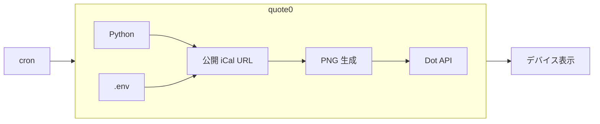

# ふれるカレンダー


## 目的

電子ペーパーデバイス（Quote/0）を利用して、直近の予定が一目で分かるようにする。


## 概要

公開 iCal から **今日・予定がある次の日** の予定を PNG にし、[Quote/0（Dot.）](https://dot.mindreset.tech/) の表示を更新する。




## 技術スタック

- Python 3.12（[.python-version](./.python-version)）
- pytest・Pillow・icalendar・recurring_ical_events・python-dotenv
- 運用は Linux 上の cron（[docs/deploy.md](./docs/deploy.md)）


## 設計の要点

- パイプラインは **iCal 取得 → 解析 → PNG 生成 → Dot 送信**。前段が成功したときだけ次へ進む
- いずれかで失敗したときは **Dot は更新しない**（直前の表示を維持）
- 抽出する予定は **JST の半開区間**（今日・次の予定日）
- 並びは **URL 列挙順 → 開始時刻 → UID** で決定的
- **1 枚の PNG** に最大 2 日分を載せる（詳細は [AGENTS.md](./AGENTS.md)）


## ローカル単体テスト

```bash
python3.12 -m venv .venv
.venv/bin/pip install -r requirements.txt -r requirements-dev.txt
.venv/bin/python -m pytest
```

本番デプロイ・サーバ上の手順は [docs/deploy.md](./docs/deploy.md) を参照。


## ドキュメント

| ファイル | 内容 |
|---------|------|
| [AGENTS.md](./AGENTS.md) | 要件・振る舞い・単体テスト観点・骨組みの地図（仕様の正本） |
| [docs/deploy.md](./docs/deploy.md) | セットアップ・更新・単体テスト実行手順 |
| [docs/git.md](./docs/git.md) | Git 運用・コミットメッセージ |
| [.env.example](./.env.example) | 環境変数名テンプレ |
| [LICENSE](./LICENSE) | 本体（MIT）。フォントは [quote0/fonts/LICENSE](./quote0/fonts/LICENSE)（OFL） |
