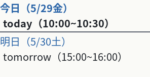
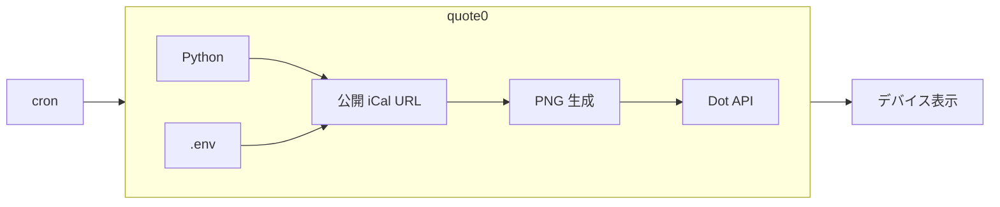

# ふれるカレンダー


## 目的

電子ペーパーデバイス（Quote/0）を利用して、直近の予定が一目で分かるようにする。




## 概要

公開 iCal から **今日・予定がある次の日** の予定を PNG に変換し、[Quote/0（Dot.）](https://dot.mindreset.tech/) の表示を更新する。




## 最低限の動作確認手順

- 詳細な手順は [docs/deploy.md](./docs/deploy.md) を参照
- Python **3.12** （[.python-version](./.python-version)）


### 1. 環境構築

```bash
git clone https://github.com/ryofujimotox/quote0 && cd quote0
python -m pip install -r requirements.txt
cp -n .env.example .env
```

- `.env` を編集する。[AGENTS.md](./AGENTS.md) どおり。
  - APIキー（`.env` の `DOT_API_TOKEN`）: [Dot. ドキュメント](https://dot.mindreset.tech/docs/service/open/get_api)
  - デバイスID（`.env` の `DOT_DEVICE_ID`）: [Dot. ドキュメント](https://dot.mindreset.tech/docs/service/open/get_device_id)
  - iCal URL（`.env` の `ICAL_URLS`）: [例）Google カレンダーの公開 URL](https://support.google.com/calendar/answer/37648?hl=ja#zippy=%2C%E3%82%AB%E3%83%AC%E3%83%B3%E3%83%80%E3%83%BC%E3%82%92%E8%A1%A8%E7%A4%BA%E3%81%99%E3%82%8B%E9%96%B2%E8%A6%A7%E3%81%AE%E3%81%BF)


### 2. 手動実行

```bash
python -m quote0                          # Dot 接続を確認する
python -m quote0.commands.get_devices     # 登録済みデバイス一覧を取得する
python -m quote0.commands.send_ical       # 予定 PNG を Dot へ送信する
```


## 技術スタック

- Python 3.12（[.python-version](./.python-version)）
- iCal（予定の取得・解析）
- Dot API（Quote/0 表示更新）
- pytest（単体テスト）


## 設計の要点

- **iCal 取得 → 解析 → PNG 生成 → Dot 送信** の順で実行
- 抽出する予定は **今日と次の予定日**
- 並びは **URL 列挙順 → 開始時刻 → UID**


## フォルダ構成

```
quote0/
  main.py               # .env + Dot 接続確認（python -m quote0）
  commands/             # 実行可能コマンド（get_devices / send_ical）
  content/
    ical_image/         # iCal → PNG
    jp_quote0_client.py # Dot API アダプタ
  vendor/               # SDK

tests/                  # 単体テスト（quote0/ と同じ階層）
  commands/
  content/

AGENTS.md               # 要件・振る舞い（仕様の正本）
docs/deploy.md          # Linux 配置・cron
docs/git.md             # Git 運用
docs/issue-parallel-plan.md  # Issue 並行解決プラン（テンプレート）
.env.example            # 環境変数名テンプレ
LICENSE                 # 本体（MIT）
quote0/content/ical_image/fonts/LICENSE   # フォント（OFL）
quote0/vendor/quote0_client/LICENSE       # SDK（MIT）
```
