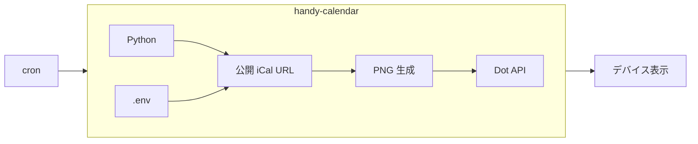

# handy-calendar

ふれるカレンダー

公開 iCal から **今日・明日** の予定を PNG にし、[Quote/0（Dot.）](https://dot.mindreset.tech/) の表示を更新するバッチ。

## ドキュメント

| ファイル | 内容 |
|---------|------|
| [AGENTS.md](./AGENTS.md) | 要件・振る舞い・単体テスト観点・骨組みの地図（仕様の正本） |
| [docs/deploy.md](./docs/deploy.md) | セットアップ・更新・単体テスト実行手順 |
| [docs/git.md](./docs/git.md) | Git 運用・コミットメッセージ |
| [.env.example](./.env.example) | 環境変数名テンプレ |
| [TODO.md](./TODO.md) | 未完了タスク（チェックリスト） |
